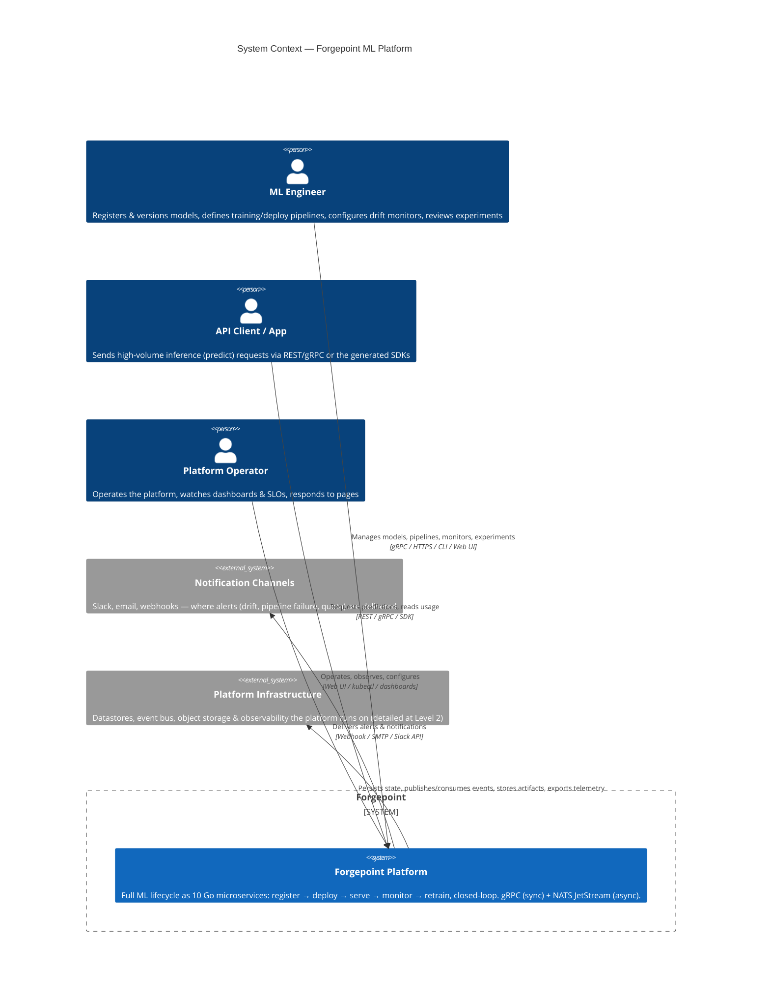
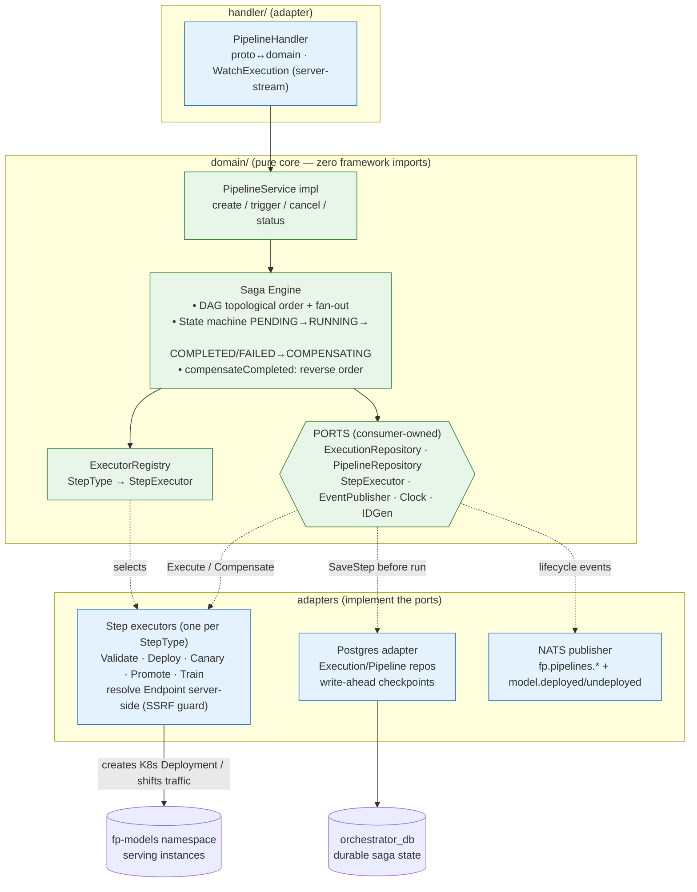
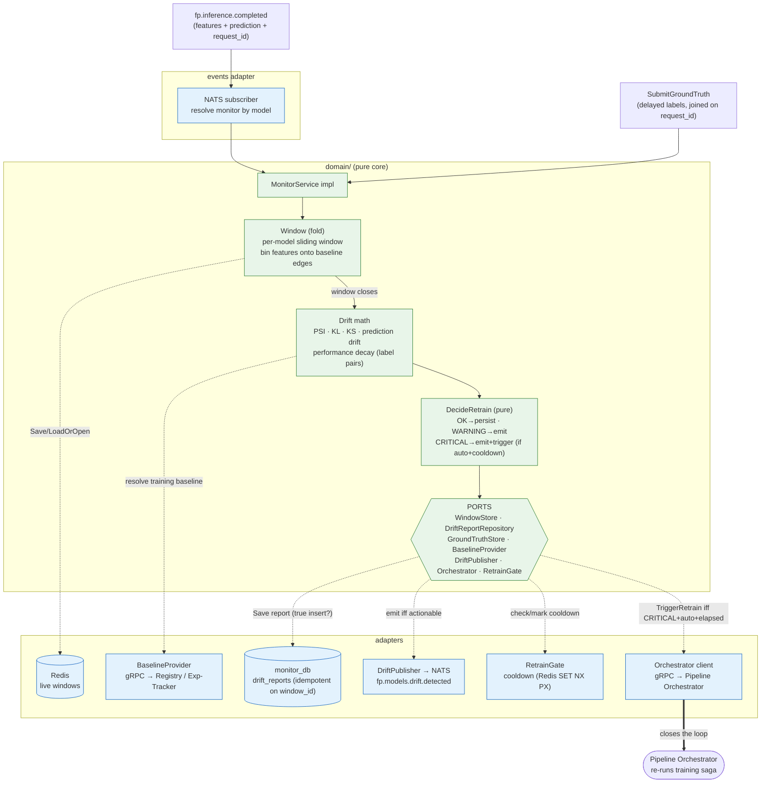
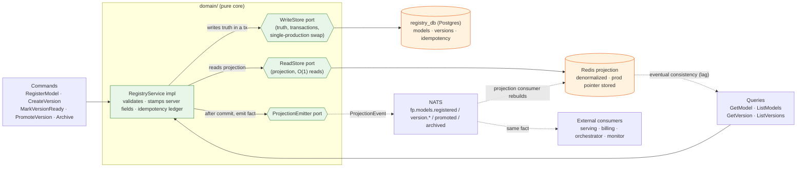
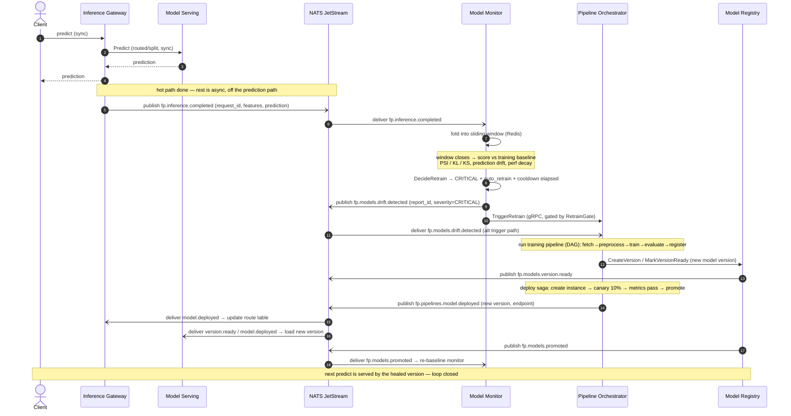

# Forgepoint — C4 Architecture Model

> **What this is.** A [C4 model](https://c4model.com/) of Forgepoint at three zoom levels —
> **Context** (the system in its world), **Container** (the M0–M6 services + the data/async
> infra and how they talk), and **Component** (the inside of the three most interesting
> services) — plus a sequence for the **closed ML loop** that is the whole point of the
> platform. The M7 AI Gateway is not drawn here yet. Each diagram has a short explanatory
> paragraph; read those, not just the boxes.
>
> **Sources of truth.** Services, communication, and infra come from
> [`docs/plans/forgepoint-platform-design.md`](../plans/forgepoint-platform-design.md). Every
> async edge below is taken **verbatim** from the canonical subject registry in
> [`docs/design/event-contract.md`](../design/event-contract.md) — if an arrow here disagrees
> with that table, the table wins. Component internals are grounded in the real
> `internal/domain/ports.go` of each service.
>
> **How to read the edge styles.** Solid arrows are **synchronous gRPC** (request/reply, a
> deadline, a caller waiting). Dashed/labelled `fp.*` arrows are **asynchronous NATS
> JetStream** events (fire-and-forget, at-least-once, the producer does not wait and does not
> know who consumes). The single most important fact about this architecture is *which edges
> are which*: the hot inference path is sync and must be fast; the lifecycle/metering/monitor
> fabric is async so it can never slow down or break a prediction.

---

## Level 1 — System Context

**Reading this diagram.** At this zoom Forgepoint is **one box**. The point of a Context diagram is to
fix the *boundary* and the *actors*, not the internals. Three human/role actors drive the
system: **ML Engineers** (register models, define pipelines, read drift), **API Clients** (the
apps and SDKs that send the high-volume `predict` traffic), and **Platform Operators** (run it,
watch dashboards, get paged). They all enter through **one front door** — they never reach a
service directly. Outside the boundary sit things Forgepoint *uses but does not own*: the
identity source of truth is internal (Auth), but notifications fan out to **external channels**
(Slack / email / webhooks), and at this level the "infrastructure" (databases, the event bus,
object storage, the observability stack) is summarised as a single supporting system — we open
it up at Level 2. Deliberately **no AWS/EKS/RDS specifics**: those are a *deployment* concern,
not an *architecture* concern, and pinning them here would wrongly imply the design is tied to
one cloud.



---

## Level 2 — Containers

**Reading this diagram.** This is the workhorse diagram: the **10 services**, the **edge tier** (API
Gateway + BFF), the **data infrastructure** (a Postgres database *per service* — never shared —
plus shared Redis, NATS JetStream, and MinIO/S3), and the **observability** sink. The shape to
internalise is a **request spine that is synchronous** and an **event fabric that is
asynchronous**. Clients hit the gateway; the gateway and BFF call services over **gRPC**
(solid). A `predict` is the hot path: Gateway → Model Serving, sync, fast, protected by a
circuit breaker and rate limiter. Everything that must happen *around* a prediction —
metering it, recording it as an experiment, feeding it to drift windows — happens **off the hot
path** over NATS (dashed `fp.*`). That is why a billing outage or a monitor restart can never
fail a prediction: they are on the async side of the wall.

Read the green/`fp.*` edges as the platform's nervous system, and note three flows the brief
calls out specifically:

1. **One inference, three reactors.** `inference-gateway` publishes **`fp.inference.completed`**
   exactly once; **billing** meters it, **experiment-tracker** records it, and **model-monitor**
   folds it into a drift window. One event, many independent consumers — no fan-out logic in the
   gateway, no callback into it.
2. **The loop-closer.** **model-monitor** publishes **`fp.models.drift.detected`**; the
   **pipeline-orchestrator** consumes it and (on CRITICAL + auto-retrain) re-runs the training
   saga — this is the edge that closes serve → monitor → retrain.
3. **Deploy lifecycle is the saga's, not serving's.** The orchestrator owns
   **`fp.pipelines.model.deployed`**; the gateway and serving *consume* it to update their route
   table — serving never publishes a competing deploy/metering event (a conflict the event
   contract explicitly resolved).

> Database-per-service is drawn literally: each service has its **own** `*_db` so no service can
> reach into another's tables — all cross-service data flow is an API call or an event, never a
> shared query. Redis is shared *infrastructure* but **logically partitioned** (registry's read
> projection, gateway's rate-limit counters, monitor's live windows are independent keyspaces).

```mermaid
C4Container
    title Container Diagram — Forgepoint (gRPC sync spine + NATS async fabric)

    Person(mle, "ML Engineer", "Models, pipelines, monitors")
    Person(client, "API Client", "predict traffic")
    Person(ops, "Operator", "Operates & observes")
    System_Ext(channels, "Notification Channels", "Slack / email / webhook")

    System_Boundary(fp, "Forgepoint") {

        Container(gateway_edge, "API Gateway", "Traefik/Kong", "TLS termination, external routing, coarse auth — the single front door")
        Container(bff, "BFF", "Go", "Backend-for-Frontend for the Web UI: gRPC↔JSON/SSE composition, ZERO business logic (ADR 0001)")

        Container(auth, "Auth / IAM", "Go gRPC", "API keys, JWT issuance, RBAC. Called by every service via shared interceptor")
        Container(registry, "Model Registry", "Go gRPC", "CQRS: write Postgres, read Redis projection. Model & version lifecycle")
        Container(infgw, "Inference Gateway", "Go gRPC+HTTP", "Circuit breaker, rate limit, traffic split (canary). Mints request_id, owns InferenceCompleted")
        Container(serving, "Model Serving", "Go + ONNX", "One Deployment per model version. In-memory model, HPA on inflight. Pulls artifacts from MinIO")
        Container(orch, "Pipeline Orchestrator", "Go gRPC", "Saga + DAG engine: validate→deploy→canary→promote with reverse-order compensation")
        Container(feature, "Feature Store", "Go gRPC", "Event sourcing: append-only feature log → materialized online/offline views")
        Container(exp, "Experiment Tracker", "Go gRPC", "Event-driven: batches high-volume metric events into time-partitioned tables")
        Container(billing, "Billing / Usage", "Go gRPC", "Outbox pattern: meters usage, enforces quotas, generates invoices")
        Container(notif, "Notification", "Go gRPC", "Choreography: pure event reactor, subscribes fp.> and applies user rules")
        Container(monitor, "Model Monitor", "Go gRPC", "Streaming drift (PSI/KL/KS) over windows + closed-loop retrain trigger")

        ContainerDb(auth_db, "auth_db", "PostgreSQL", "users, api_keys, roles")
        ContainerDb(reg_db, "registry_db", "PostgreSQL", "models, versions (write/truth)")
        ContainerDb(orch_db, "orchestrator_db", "PostgreSQL", "executions, saga_state, step_logs (durable WAL)")
        ContainerDb(feat_db, "feature_db", "PostgreSQL", "feature_events (append-only)")
        ContainerDb(exp_db, "experiment_db", "PostgreSQL", "experiments, runs, metrics")
        ContainerDb(bill_db, "billing_db", "PostgreSQL", "usage_events, quotas, outbox")
        ContainerDb(notif_db, "notification_db", "PostgreSQL", "rules, delivery_log")
        ContainerDb(mon_db, "monitor_db", "PostgreSQL", "monitors, drift_reports")

        ContainerDb(redis, "Redis", "Redis", "registry read-projection · gateway rate counters · monitor live windows (partitioned)")
        ContainerDb(minio, "MinIO / S3", "Object store", "Model artifact weights (ONNX)")
        ContainerQueue(nats, "NATS JetStream", "Event bus", "fp.* subjects · event envelopes · consumer groups · DLQ")
        Container(obsv, "Observability", "OTel→Prom/Loki/Tempo", "Metrics, logs, traces from all services")
    }

    %% ---- ingress (sync) ----
    Rel(client, gateway_edge, "predict / queries", "REST/gRPC")
    Rel(mle, gateway_edge, "manage", "gRPC/CLI")
    Rel(ops, bff, "Web UI", "HTTPS/SSE")
    Rel(gateway_edge, bff, "UI traffic", "gRPC")
    Rel(gateway_edge, infgw, "predict", "gRPC/HTTP")
    Rel(gateway_edge, registry, "model mgmt", "gRPC")
    Rel(gateway_edge, orch, "pipeline mgmt", "gRPC")

    %% ---- auth is called by everyone (sync) ----
    Rel(infgw, auth, "ValidateToken / CheckPermission", "gRPC")
    Rel(registry, auth, "authz", "gRPC")
    Rel(orch, auth, "authz", "gRPC")

    %% ---- hot inference path (sync) ----
    Rel(infgw, serving, "Predict (routed, split)", "gRPC")
    Rel(serving, minio, "Pull artifact on load", "S3 API")
    Rel(infgw, redis, "rate counters / route cache", "RESP")

    %% ---- per-service datastores (sync) ----
    Rel(auth, auth_db, "reads/writes", "SQL")
    Rel(registry, reg_db, "writes (truth)", "SQL")
    Rel(registry, redis, "reads (projection)", "RESP")
    Rel(orch, orch_db, "write-ahead checkpoints", "SQL")
    Rel(feature, feat_db, "append events", "SQL")
    Rel(feature, redis, "online view", "RESP")
    Rel(exp, exp_db, "batched writes", "SQL")
    Rel(billing, bill_db, "usage + outbox", "SQL")
    Rel(notif, notif_db, "rules/log", "SQL")
    Rel(monitor, mon_db, "reports", "SQL")
    Rel(monitor, redis, "live windows", "RESP")

    %% ---- loop-closer (sync gRPC, monitor→orchestrator) ----
    Rel(monitor, orch, "TriggerRetrain (auto-retrain)", "gRPC")

    %% ---- async event fabric (NATS) — verbatim from event-contract.md ----
    Rel(registry, nats, "fp.models.registered / version.created / version.ready / promoted / archived", "publish")
    Rel(orch, nats, "fp.pipelines.* + fp.pipelines.model.deployed/undeployed", "publish")
    Rel(infgw, nats, "fp.inference.completed / failed", "publish")
    Rel(feature, nats, "fp.features.view.defined / written", "publish")
    Rel(billing, nats, "fp.billing.usage.recorded / quota.exceeded / invoice.generated", "publish")
    Rel(monitor, nats, "fp.models.drift.detected", "publish")
    Rel(notif, nats, "fp.notifications.delivered / failed", "publish")
    Rel(exp, nats, "fp.experiments.run.created / finished", "publish")

    Rel(nats, orch, "fp.models.registered · fp.models.drift.detected (retrain)", "consume")
    Rel(nats, infgw, "fp.pipelines.model.deployed/undeployed · fp.models.promoted · fp.billing.quota.exceeded", "consume")
    Rel(nats, serving, "fp.models.version.ready · model.deployed · promoted · archived", "consume")
    Rel(nats, billing, "fp.inference.completed · fp.models.version.ready", "consume")
    Rel(nats, monitor, "fp.inference.completed · fp.features.written · fp.models.promoted", "consume")
    Rel(nats, exp, "fp.inference.completed · pipelines.* · features.written · drift.detected · ...", "consume")
    Rel(nats, notif, "fp.> (pipelines.failed · billing.quota.exceeded · models.drift.detected · ...)", "consume")

    Rel(notif, channels, "deliver", "Webhook/SMTP/Slack")

    UpdateLayoutConfig($c4ShapeInRow="4", $c4BoundaryInRow="1")
```



### The async edges, exactly as contracted

This table is the same data the dashed arrows encode, in the order of the
[subject registry](../design/event-contract.md#subject-registry-authoritative). It is the
ground truth for the diagram — a reviewer should be able to check every `fp.*` arrow against a
row here.

| Subject | Producer | Consumers |
|---|---|---|
| `fp.models.registered` | registry | pipeline-orchestrator, experiment-tracker |
| `fp.models.version.created` | registry | experiment-tracker |
| `fp.models.version.ready` | registry | serving, billing, pipeline-orchestrator |
| `fp.models.promoted` | registry | inference-gateway, serving, model-monitor, billing |
| `fp.models.archived` | registry | inference-gateway, serving, billing |
| `fp.models.drift.detected` | **model-monitor** | notification, experiment-tracker, **pipeline-orchestrator** (closes loop) |
| `fp.pipelines.started` | pipeline-orchestrator | notification, experiment-tracker |
| `fp.pipelines.step.completed` | pipeline-orchestrator | experiment-tracker |
| `fp.pipelines.step.failed` | pipeline-orchestrator | notification |
| `fp.pipelines.completed` | pipeline-orchestrator | experiment-tracker, notification |
| `fp.pipelines.failed` | pipeline-orchestrator | notification |
| `fp.pipelines.compensation.triggered` | pipeline-orchestrator | notification |
| `fp.pipelines.model.deployed` | **pipeline-orchestrator** | inference-gateway, serving, experiment-tracker |
| `fp.pipelines.model.undeployed` | pipeline-orchestrator | inference-gateway, serving |
| `fp.inference.completed` | **inference-gateway** | **billing, experiment-tracker, model-monitor** |
| `fp.inference.failed` | inference-gateway | model-monitor, notification |
| `fp.features.view.defined` | feature-store | experiment-tracker |
| `fp.features.written` | feature-store | experiment-tracker, model-monitor |
| `fp.billing.usage.recorded` | billing | experiment-tracker |
| `fp.billing.quota.exceeded` | billing | notification, inference-gateway |
| `fp.billing.invoice.generated` | billing | notification |
| `fp.experiments.run.created` | experiment-tracker | notification |
| `fp.experiments.run.finished` | experiment-tracker | notification, experiment-tracker |
| `fp.notifications.delivered` | notification | experiment-tracker |
| `fp.notifications.failed` | notification | experiment-tracker, on-call escalation |

---

## Level 3 — Components

We open up the **three most architecturally interesting** services. Each follows the same
Clean/Hexagonal layout (`handler → domain ← repository/events`, ports owned by the domain), so
once you can read one you can read all ten — but these three carry the platform's signature
patterns: the **saga**, the **closed loop**, and **CQRS**.

### 3a — Pipeline Orchestrator (Saga + DAG engine)

**Reading this diagram.** The orchestrator is the platform's **Temporal-lite**: a generic workflow
engine where the *engine is pure* and all side effects live behind one port. The component to
stare at is **`StepExecutor`** (`internal/domain/ports.go`) — the engine sequences steps, runs
the **state machine** (`PENDING→RUNNING→COMPLETED/FAILED`, then `COMPENSATING`), and on failure
runs **compensations in reverse order of completion** — but it *never knows* how a DEPLOY makes
a K8s Deployment or how a CANARY shifts traffic. That work sits behind `StepExecutor`
implementations chosen by a `StepType` registry. This is exactly what makes the saga
unit-testable with mock executors that simulate success/failure/panic with no real
infrastructure.

Three mechanics, all visible below: **(1) durability** — every step is
written to Postgres (`ExecutionRepository.SaveStep`) *before* it runs (write-ahead), so a
crashed orchestrator reloads the last checkpoint and **resumes** rather than restarts;
**(2) compensation-failure** — a `Compensate` that errors is *not* swallowed, it ends the saga
`COMPENSATION_FAILED` and pages a human (we may have leaked a real serving pod);
**(3) SSRF guard** — the serving `Endpoint` carried in `ModelDeployed` is *resolved by the
executor* from the K8s Service it created, **never** read from client config.



**Deployment saga — the state machine & compensation (from the design doc):**

```text
  Trigger
    │  (each step: SaveStep→RUNNING  →  Execute  →  SaveStep→COMPLETED)
    ▼
  ┌─ Validate Model ─────────── fail → (nothing to compensate)
  │    │ ok
  ├─ Create Serving Instance ── fail → Destroy Instance
  │    │ ok
  ├─ Run Canary (10%) ───────── fail → Rollback Traffic + Destroy Instance
  │    │ ok (metrics pass)
  ├─ Promote to 100% ────────── fail → Rollback to Previous Version
  │    │ ok
  └─ Mark Complete
        on any fail → COMPENSATING: run the ▲ compensations in REVERSE completion order
        a compensation that errors → step COMPENSATION_FAILED → saga FAILED + page
```

### 3b — Model Monitor (the closed loop: sense → decide → act)

**Reading this diagram.** Model Monitor is where the lifecycle becomes a *loop*. It runs a
**streaming-aggregation control loop**: every `fp.inference.completed` is folded into a per-model
**sliding Window** (Redis); when a window closes it is scored against the model's **training
baseline** (resolved server-side from the Registry — never client-supplied, so an attacker can't
hand-craft a baseline that hides drift) using **PSI / KL / KS** for data drift, prediction
drift, and — when delayed ground-truth labels arrive via `SubmitGroundTruth` — performance
decay. The scored `DriftReport` is saved **idempotently on its window id** (one window → one
report → at most one event).

The decision half is a **pure policy** (`DecideRetrain`) with an explicit truth table:
`OK` persists silently; `WARNING` emits `ModelDriftDetected` (alert a human) but does **not**
retrain; `CRITICAL` emits *and*, if `auto_retrain` is on with a pipeline configured *and* the
**cooldown** has elapsed, fires `TriggerRetrain` at the orchestrator. That cooldown
(`RetrainGate`) is the anti-storm valve — without it a sustained drift would re-trigger a
retrain on every window close (every few seconds). Same idea as Alertmanager's
`repeat_interval` or a thermostat's anti-short-cycle delay.



### 3c — Model Registry (CQRS)

**Reading this diagram.** The Registry is the canonical **CQRS** case: the *write model* and the
*read model* are **separate stores with separate ports**. Commands (`RegisterModel`,
`CreateVersion`, `PromoteVersion`, …) go to the **WriteStore** (Postgres) — the normalized
source of truth, where transactions enforce the invariants (`(team,name)` uniqueness, and the
**single-production** invariant: `PromoteVersionTx` swaps the new prod version *and* demotes the
old one in one transaction, so there is never a moment with two PRODUCTION versions). Queries
(`GetModel`, `ListModels`, …) read the **ReadStore** (Redis), a denormalized projection where
"prod version of X" is a *stored field*, not a read-time join — which is what lets the hot
inference path read it thousands of times a second.

The seam between them is the **`ProjectionEmitter`** port, and *why it is a port matters*: the
command does **not** dual-write Postgres+Redis (that's the dual-write problem — the second write
can fail after the first commits, with no rollback). Instead the command writes **one** store
and **emits an event**; a projection consumer rebuilds Redis from that event, idempotently. The
*same* emitted fact feeds the internal Redis projection **and** external consumers (serving,
billing) — one event, many readers. The accepted tradeoff, documented on every query, is
**eventual consistency**: the command *response* returns the write-store truth (read-your-writes
for the caller), but the query RPCs read the slightly-lagging projection.



---

## The Closed Loop — `serve → monitor → retrain → promote → serve`

**Reading this diagram.** This is the sequence the whole platform exists to demonstrate: a model that
**degrades in production heals itself** with no human in the hot path. Follow the wall between
sync and async. The prediction (1–2) is **synchronous** and fast. Everything that closes the
loop rides the **async** fabric: the single `fp.inference.completed` (3) fans out to billing,
experiment-tracker, and the monitor; the monitor's windowed drift verdict becomes
`fp.models.drift.detected` (7); the orchestrator consumes it and runs the retrain **saga**
(8–11), which produces a new version in the Registry, canaries it, and on healthy metrics
promotes it — and the very next prediction is served by the new version, **re-baselining the
monitor**. Loop closed.

The two guardrails that make this safe to run unattended — both already in the component
diagrams — are the monitor's **cooldown** (`RetrainGate`, so a sustained drift can't trigger a
retrain storm) and the saga's **canary-then-compensate** (a bad new version is rolled back, not
promoted). Note the loop only *auto*-closes on `CRITICAL` + `auto_retrain`; a `WARNING` alerts a
human and stops there.


